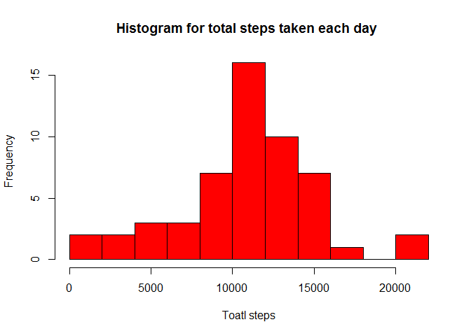
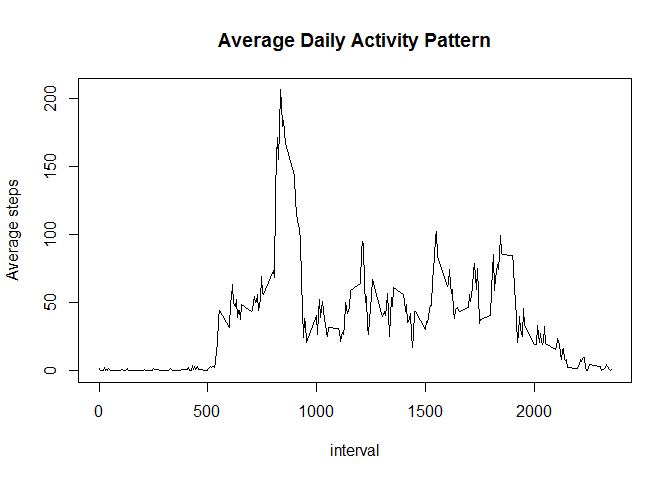
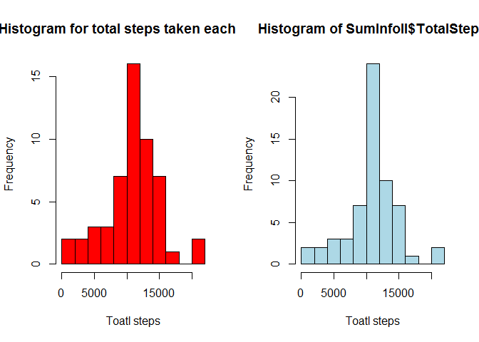
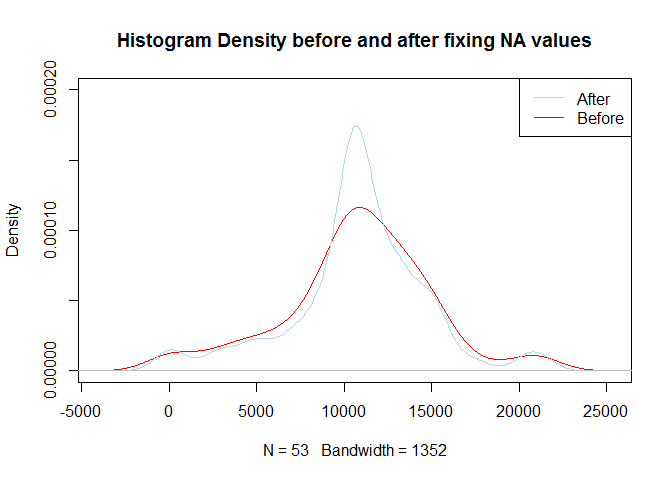
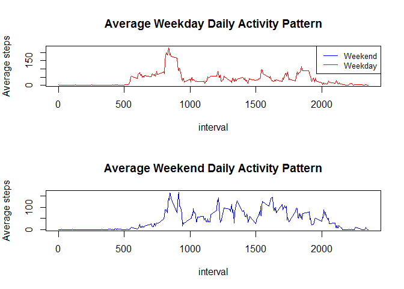

# Reproducible Research: Peer Assessment 1

Assignment 1 for Reproducible Research by Jianyi.

## Loading and preprocessing the data

(Process/transform the data (if necessary) into a format suitable for your analysis)

1.Load the data  

```r
#some preparation
#install.packages("dplyr")
#install.packages("ggplot2")
#install.packages("plyr")
#install.packages("lubridate")
library(lubridate)
library(plyr)
library(ggplot2)
library(dplyr)

#load the data
setwd("C:/Users/Jianyi/Documents/DS5/ProjectI")
rawdata=read.csv("activity.csv",stringsAsFactors=FALSE)
```

## What is mean total number of steps taken per day?

For this part of the assignment, you can ignore the missing values in the dataset.

1.Calculate the total number of steps taken per day


```r
#clean all NA values
data=filter(rawdata,complete.cases(rawdata$steps))

#check how many days are there in the data
days=length(unique(data$date))

#create/initialize a data frame(called "SumInfo") to summarize information on total number of steps taken per day. The row is each day and it has two columns:
#Date       TotalSteps
#2012-10-01   n
#....         ...
SumInfo=data.frame(matrix(, nrow = days, ncol = 2))
names(SumInfo)[1]="Date"
names(SumInfo)[2]="TotalSteps"

###calculate sum steps for each day
SumInfo$Date=unique(data$date)
count=1#initate the count of the row numbers to help locate filling position in SumInfo
for(i in SumInfo$Date){
  subset=filter(data,date==i)#filter to create a subset that has info only for a certain day
  SumInfo$TotalSteps[count]=as.numeric(sum(subset$steps))#calculate the total steps for that day
  count=count+1
}
```

2.If you do not understand the difference between a histogram and a barplot, research the difference between them. Make a histogram of the total number of steps taken each day


```r
hist(SumInfo$TotalSteps,main="Histogram for total steps taken each day ",breaks=10,xlab="Toatl steps",col="red")
```

 

3.Calculate and report the mean and median of the total number of steps taken per day

```r
mean(SumInfo$TotalSteps)
```

```
## [1] 10766.19
```

```r
median(SumInfo$TotalSteps)
```

```
## [1] 10765
```


## What is the average daily activity pattern?


1.Make a time series plot (i.e. type = "l") of the 5-minute interval (x-axis) and the average number of steps taken, averaged across all days (y-axis)

```r
#create/initialize a data frame(called "PatternInfo") to summarize information on total number of steps taken per day. The row is each interval and it has two columns:
#Interval       IntervalAverage
#0                x
#....         ...
PatternInfo=data.frame(matrix(, nrow =length(unique(data$interval)),ncol = 2))
names(PatternInfo)[1]="Interval"
names(PatternInfo)[2]="IntervalAverage"

#calculate average for each interval
PatternInfo$Interval=unique(data$interval)                            
count=1 #initate the count of the row numbers to help locate filling position in PatternInfo                                               
for(i in unique(data$interval)){
  subset=filter(data,interval==i)
  PatternInfo$IntervalAverage[count]=mean(subset$steps)
  count=count+1
}

#Plotting
plot(PatternInfo$Interval,PatternInfo$IntervalAverage,main="Average Daily Activity Pattern",xlab="interval",ylab="Average steps",type="l")
```

 


2.Which 5-minute interval, on average across all the days in the dataset, contains the maximum number of steps?


```r
PatternInfo$Interval[which(PatternInfo$IntervalAverage==max(PatternInfo$IntervalAverage))]
```

```
## [1] 835
```


## Imputing missing values

Note that there are a number of days/intervals where there are missing values (coded as NA). The presence of missing days may introduce bias into some calculations or summaries of the data.

1.Calculate and report the total number of missing values in the dataset (i.e. the total number of rows with NAs)


```r
summary(complete.cases(rawdata$steps))
```

```
##    Mode   FALSE    TRUE    NA's 
## logical    2304   15264       0
```

```r
summary(complete.cases(rawdata$interval))
```

```
##    Mode    TRUE    NA's 
## logical   17568       0
```

```r
summary(complete.cases(rawdata$date))
```

```
##    Mode    TRUE    NA's 
## logical   17568       0
```

```r
# it seems only setps have missing values
```

2.Devise a strategy for filling in all of the missing values in the dataset. The strategy does not need to be sophisticated. For example, you could use the mean/median for that day, or the mean for that 5-minute interval, etc.

3.Create a new dataset that is equal to the original dataset but with the missing data filled in.


```r
#create a data frame called RevisedData, which has all missing values fixed by the mean of the 5 mins interval average
RevisedData=rawdata

MissingRows=which(complete.cases(rawdata)==FALSE)#find all the row numbers for those missig values lines

for(i in MissingRows){
  IV=RevisedData$interval[i]#for each NA spot, get its corresponding interval, the name IV=InterVal
  RevisedData$steps[i]=(PatternInfo$IntervalAverage[which(PatternInfo$Interval==IV)])#do the replacement
  
}
```


4.Make a histogram of the total number of steps taken each day and Calculate and report the mean and median total number of steps taken per day. Do these values differ from the estimates from the first part of the assignment? What is the impact of imputing missing data on the estimates of the total daily number of steps?

```r
#Calculate(for the revised data frame with all NA values fixed) the  total numbers for each day, mean and median, basically did the same thing as before except change data->RevisedData

##check how many days are there in the data
days=length(unique(RevisedData$date))

##create/initialize a data frame(called "SumInfoII") to summarize information on total number of steps taken per day. The row is each day and it has two columns:

##Date       TotalSteps
##2012-10-01   n
##....         ...

SumInfoII=data.frame(matrix(, nrow = days, ncol = 2))
names(SumInfoII)[1]="Date"
names(SumInfoII)[2]="TotalSteps"

###calculate sum steps for each day

SumInfoII$Date=unique(RevisedData$date)
count=1#initate the count of the row numbers to help locate filling position in SumInfo
for(i in SumInfoII$Date){
  subset=filter(RevisedData,date==i)#filter to create a subset that has info only for a certain day
  SumInfoII$TotalSteps[count]=as.numeric(sum(subset$steps))#calculate the total steps for that day
  count=count+1
}

###do the hist plottings
par(mfrow=c(1,2))
hist(SumInfo$TotalSteps,main="Histogram for total steps taken each day ",breaks=10,xlab="Toatl steps",col="red")#before 
hist(SumInfoII$TotalSteps,breaks=10,xlab="Toatl steps",col="light blue")#after
```

 

```r
#compare the two histogram density lines
par(mfrow=c(1,1))
plot(density(SumInfo$TotalSteps),col="red",ylim=range(0,0.0002),main="Histogram Density before and after fixing NA values")
par(new=TRUE)
lines(density(SumInfoII$TotalSteps),col="light blue")
legend("topright",c("After","Before"), col=c("light blue","red"), lwd=c(1,1),lty =c(1,1))
```

 

The mean and median didn't change. However, the curve looks more "concentrated" and more "Gaussian-like".

```r
###calculate the mean and median before and after fixation
mean(SumInfo$TotalSteps)#oldmean
```

```
## [1] 10766.19
```

```r
mean(SumInfoII$TotalSteps)#newmean
```

```
## [1] 10766.19
```

```r
median(SumInfo$TotalSteps)#oldmedian
```

```
## [1] 10765
```

```r
median(SumInfoII$TotalSteps)#newmedian
```

```
## [1] 10766.19
```

## Are there differences in activity patterns between weekdays and weekends?

For this part the weekdays() function may be of some help here. Use the dataset with the filled-in missing values for this part.

1.Create a new factor variable in the dataset with two levels - "weekday" and "weekend" indicating whether a given date is a weekday or weekend day.

```r
newdata=mutate(RevisedData,weekend=(weekdays(ymd(RevisedData$date))=="Saturday"|weekdays(ymd(RevisedData$date))=="Sunday"))
newdata$weekend[which(newdata$weekend==TRUE)]="Weekend"
newdata$weekend[which(newdata$weekend==FALSE)]="Weekday"
```

2.Make a panel plot containing a time series plot (i.e. type = "l") of the 5-minute interval (x-axis) and the average number of steps taken, averaged across all weekday days or weekend days (y-axis). See the README file in the GitHub repository to see an example of what this plot should look like using simulated data.

```r
#create an empty dataframe
#Interval WeekdayAverage WeekendAverage
#   0         NA             NA
# ...         ...           ...
PatternInfo=data.frame(matrix(, nrow =length(unique(data$interval)),ncol = 3))
names(PatternInfo)[1]="Interval"
PatternInfo$Interval=unique(newdata$interval)  

names(PatternInfo)[2]="WeekdayAverage"
names(PatternInfo)[3]="WeekendAverage"

#calculate average for each interval                          
count=1 #initate the count of the row numbers to help locate filling position in PatternInfo                                               
for(i in unique(newdata$interval)){
  subset=filter(newdata,interval==i)
  Daysubset=filter(subset,weekend=="Weekday")#subset for all steps at this interval from weekdays
  Endsubset=filter(subset,weekend=="Weekend")#subset for all steps at this interval from weekends
  PatternInfo$WeekdayAverage[count]=mean(Daysubset$steps)
  PatternInfo$WeekendAverage[count]=mean(Endsubset$steps)
  count=count+1
}

#Plotting
par(mfrow=c(2,1),mar= c(5, 4, 4, 2))

plot(PatternInfo$Interval,PatternInfo$WeekdayAverage,main="Average Weekday Daily Activity Pattern",xlab="interval",ylab="Average steps",type="l",col="red")

legend("topright",c("Weekend","Weekday"), col=c("blue","red"), lwd=c(1,1),lty =c(1,1),cex=0.8)
 
plot(PatternInfo$Interval,PatternInfo$WeekendAverage,main="Average Weekend Daily Activity Pattern",xlab="interval",ylab="Average steps",type="l",col="blue")
```

 
